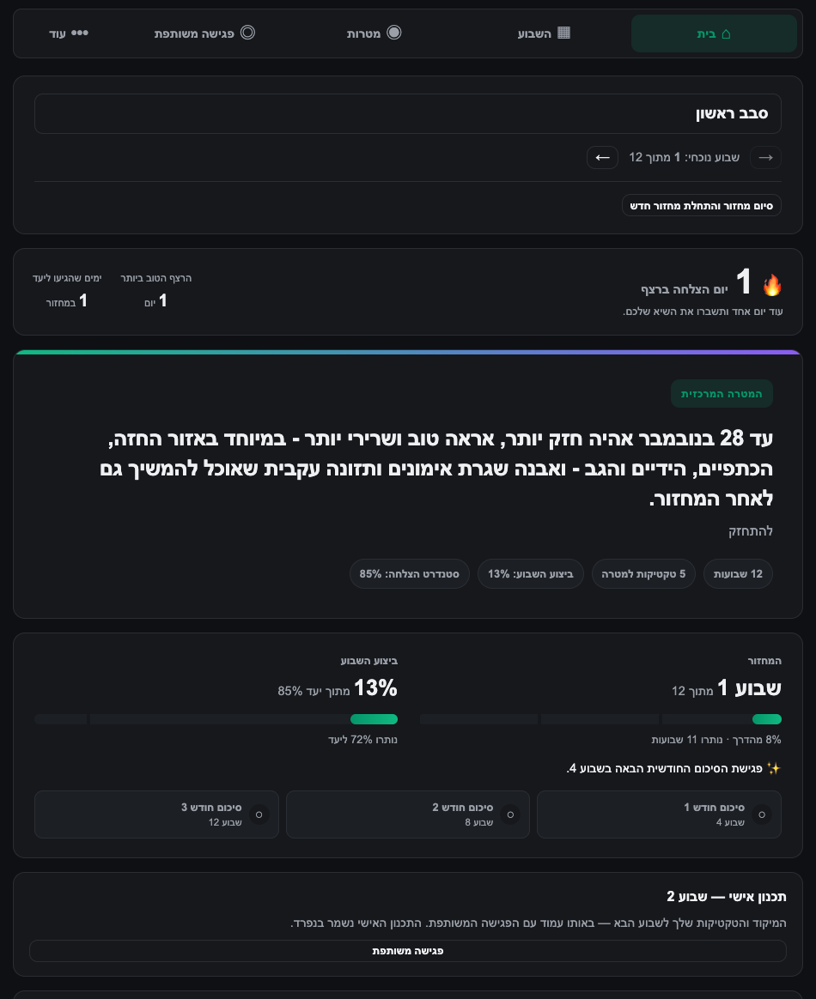
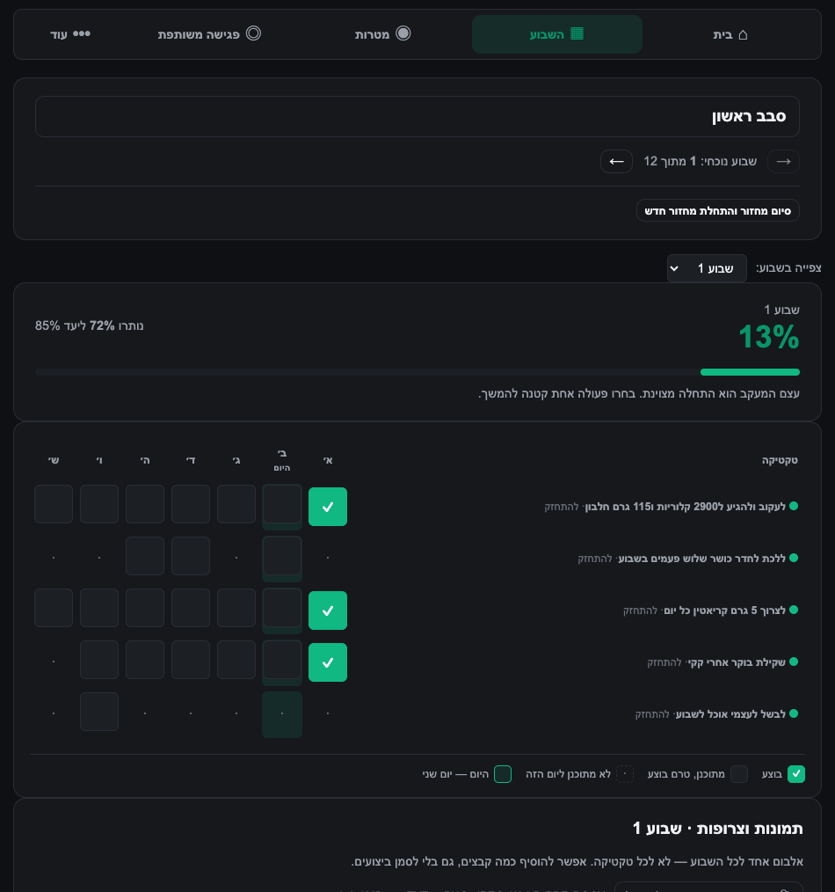
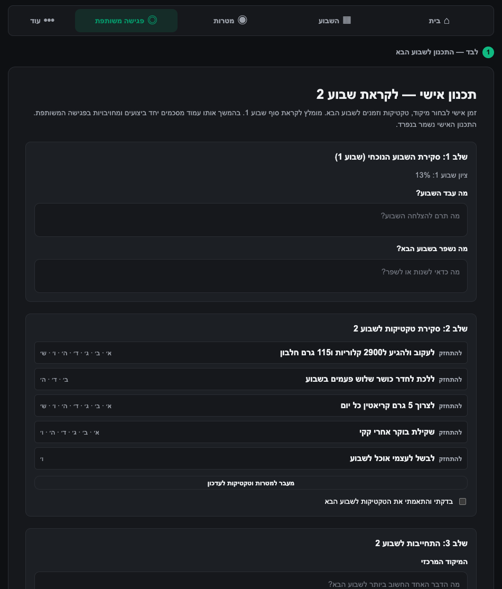
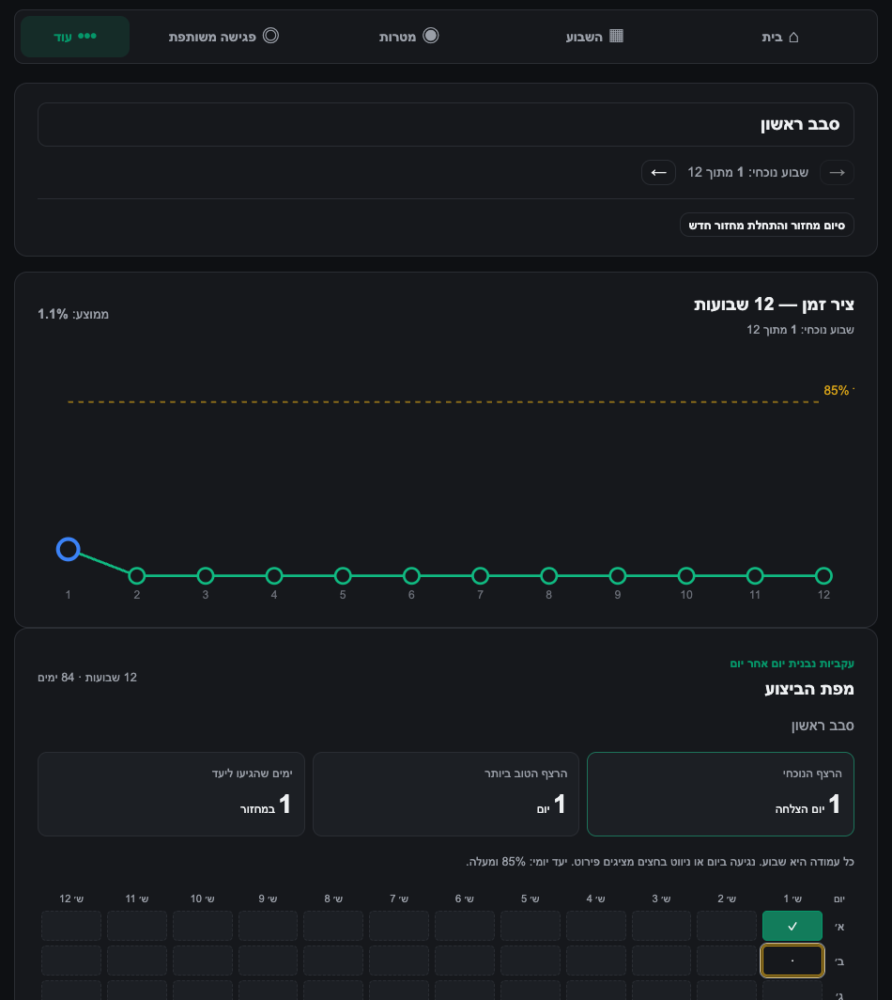

# 12wyapp

A small accountability app for two people running a [12 Week Year](https://12weekyear.com/) together.

I kept setting three-month goals and quietly abandoning them around week four. The problem was never
motivation on day one — it was that nobody noticed on day twenty. So I built this for me and a friend:
we each get our own goals, but we can both see each other's week, and once a week we sit down and go
through it together.

It's deliberately not a habit tracker you open every day. You open it twice a week, tick some boxes,
and have one honest conversation.



## How it works

You commit to a **12 week cycle** with one clear goal. Under that goal you write **tactics** — the
small repeatable things that actually move it, each with the weekdays you intend to do them.

Then every week is just a grid. Tick what you did.



The number that matters is **execution, not outcome**: what percentage of your planned tactics did
you actually complete? The target is **85%**, not 100%. Missing a couple of things a week is the
plan working as intended; missing half of them is a signal. Chasing 100% is how people quit in
week three.

Once a week there's a **meeting**. You review your own week alone first — what worked, what didn't,
what you're committing to next week — and then you go through it together with your partner. That's
where you adjust a tactic that isn't working, and see whether your partner needs a nudge.



Over 12 weeks it turns into a picture you can't argue with.



## The rest of it

Things that grew out of actually using it:

- **Streaks** — consecutive days hitting your target, on the home screen, because it turns out that's addictive
- **Broosts** — send your partner a short encouragement when their week looks rough
- **Evidence** — attach a photo to a tactic when you want the receipts
- **Recovery plans** — a bad week offers you a smaller next week instead of pretending nothing happened
- **Next-week tweaks** — adjust a tactic for the upcoming week only, without touching the rest of the cycle
- **Email reminders** — a nudge before the weekly meeting, and monthly summaries at weeks 4, 8 and 12
- **Nightly backups** — the whole thing is one SQLite file, so backing it up is genuinely trivial

## Running it

```bash
npm install
cp .env.example .env    # fill in what you need; secrets are all blank by default
npm run migrate         # creates the SQLite database

npm run dev:server      # http://localhost:4000
npm run dev:client      # http://localhost:5173  (second terminal)
```

Tests and typechecks:

```bash
npm run test:all        # server + client
npm run typecheck
```

For production — build, reverse proxy, systemd, TLS, email, backups — see
[docs/OPERATIONS.md](docs/OPERATIONS.md). It's long, but it's the actual runbook, not aspiration.

## Built with

React + TypeScript + Vite on the front, Node + Express + SQLite on the back. No ORM, no state
management library, no component framework — it's two users and a few thousand rows, and plain SQL
and `useState` handle that fine.

Sessions and reset tokens are random 32-byte values stored server-side, so there's no signing secret
anywhere in this repo to leak.

## A note on language

The interface is currently Hebrew and right-to-left, since that's what my partner and I read.
English is in progress.

---

Built for two people. Runs on the cheapest VM I could find. Happy for you to take it and adapt it.
